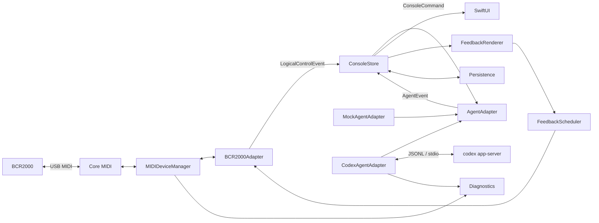

# BCR Agent Console — 开发设计

> 文档版本 0.3；状态：首个 Swift MVP 已实现；日期：2026-07-27；目标平台：macOS 14+ / Apple Silicon；目标硬件：Behringer BCR2000；输入文档：`BCR2000_Agent_Console_MVP.md` 0.1（2026-07-23）；待办：`../TODO.md`

## 1. 文档目的

本文把 MVP 需求收敛为可实施、可测试、可演进的工程设计。它用于指导后续代码结构、接口边界、安全约束、里程碑和验收，不替代产品需求。

当前仓库已完成 SwiftUI/CoreMIDI/Mock 的首个可运行纵切。本文仍描述完整产品目标；
尚未实现的 Codex adapter、批准安全门与诊断能力继续作为后续里程碑。

## 2. 已确认的开发基线

### 2.1 本机环境

| 项目 | 已验证值 |
|---|---|
| macOS | 26.5.2（Build 25F84） |
| 架构 | arm64 |
| Xcode | 26.6（Build 17F113） |
| Swift | 6.3.3 |
| Codex CLI | 0.145.0 |
| Codex App Server | 可用，但官方仍标记为 experimental |

部署目标仍保持 macOS 14+。实现时必须用 CI 或独立环境验证最低系统版本，不能因为开发机版本较新而无意使用高版本 API。

### 2.2 BCR2000 实机事实

2026-07-27 的只读枚举结果：

| 项目 | 结果 |
|---|---|
| USB 名称 | `BCR2000` |
| 厂商 | `BEHRINGER` |
| Vendor / Product ID | `0x1397 / 0x00bc` |
| USB 位置 | `0x01100000` |
| 链路 | USB 1.1 Full Speed，12 Mb/s |
| 序列号 | 未提供 |
| CoreMIDI 状态 | 在线，`offline = 0` |
| Mac 输入源 | `BCR2000 Port 1`、`BCR2000 Port 2` |
| Mac 输出目标 | `BCR2000 Port 1`、`BCR2000 Port 2`、`BCR2000 Port 3` |
| 驱动 | macOS 类兼容驱动，无需自定义驱动 |

CoreMIDI 中的 source 表示 BCR2000 → Mac，destination 表示 Mac → BCR2000。

以下信息仍需实机采集，不能在代码中猜测：

- 固件版本；
- 当前 USB 模式；
- 当前 Preset；
- 每个旋钮和按键的消息类型、通道、编号与数值模式；
- LED 环和按键灯的反馈消息；
- Port 1–3 与实体 USB/DIN 端口的准确关系；
- 软件反馈是否会形成输入回环。

### 2.3 Codex 协议事实

本设计依据本机 Codex CLI 0.145.0 生成的稳定 JSON Schema，以及当前官方 Codex App Server 文档校准：

- 默认传输为 stdio 上的逐行 JSON（JSONL）；
- 消息遵循 JSON-RPC 2.0 语义，但线上消息省略 `jsonrpc` 字段；
- 每个连接必须且只能执行一次 `initialize`，随后发送 `initialized`；
- `thread/start`、`thread/resume`、`turn/start`、`turn/interrupt`、`model/list` 与 `account/read` 均存在于当前稳定 Schema；
- 命令和文件变更批准是服务端主动发给客户端的 request，客户端必须用原 request ID 响应；
- Schema 与 Codex CLI 版本绑定，升级 CLI 时必须重新生成并执行契约测试；
- 首版默认不启用 `experimentalApi`，除非单独记录设计决策并增加兼容测试。

原 MVP 文档里的 Safe Read 示例不是本机 0.145.0 Schema 的当前形状。当前实现基线应为：

```json
{
  "type": "readOnly",
  "networkAccess": false
}
```

Workspace Write 基线为：

```json
{
  "type": "workspaceWrite",
  "writableRoots": ["/absolute/project/path"],
  "networkAccess": false
}
```

业务代码不得手写散落的协议字典；最终字段以仓库中固定版本的生成 Schema 和类型为准。

## 3. 产品范围

### 3.1 MVP 目标

应用必须能够：

1. 自动发现或手工选择 BCR2000 MIDI 端点；
2. 采集并校准全部核心硬件控件；
3. 将逻辑状态稳定反馈到 LED 环和按键灯；
4. 在 SwiftUI 中镜像 8 个 Agent 槽位；
5. 用 Mock Agent 离线验证完整交互；
6. 通过官方 `codex app-server` 管理真实 thread 和 turn；
7. 安全地启动、中断、批准、拒绝和设置下一 turn 的 effort、权限与超时；
8. 在断线、重连和进程失败时保持可解释、fail-closed 的状态。

### 3.2 明确不做

- 自定义驱动、内核扩展或 BCR2000 固件；
- 修改或注入 ChatGPT 桌面应用；
- 私有 API、Cookie 或 token 提取；
- `dangerFullAccess`；
- 静默或永久自动批准；
- 自动推送、合并或部署；
- 多 Agent 自动委派；
- 云端控制、移动端或非 macOS 客户端；
- 首版 SysEx 图形编辑器和脚踏开关支持。

## 4. 关键设计原则

1. **单一事实来源**：`ConsoleStore` 拥有用户可见的当前状态，UI 和硬件反馈只投影该状态。
2. **意图与事实分离**：旋钮改变的是“下一 turn 的配置意图”，不能伪装成正在运行任务的内部状态。
3. **协议与领域隔离**：CoreMIDI 字节和 Codex JSON-RPC 都必须在 adapter 边界被标准化。
4. **危险动作 fail closed**：上下文不完整、请求不可见、映射冲突或协议未知时拒绝执行。
5. **Mock 优先**：在真实 Codex 前完成硬件、状态机、安全门和 90 秒演示。
6. **配置驱动映射**：业务代码只认识逻辑控件 ID，不认识固定 CC/Note 编号。
7. **可观测但默认脱敏**：诊断足以定位问题，不持久化认证信息和秘密内容。
8. **稳定 API 优先**：实验协议与稳定协议在类型和能力开关上分离。

## 5. 总体架构



依赖只能指向内层领域：

```text
UI / MIDI / Codex / Persistence
              ↓
        Application Store
              ↓
          Domain Types
```

领域层不得 import CoreMIDI、SwiftUI 或进程通信实现。

## 6. 工程与模块组织

MVP 采用单一根级 Swift Package，输出一个核心 library 和一个原生 macOS executable。
FreeCM 按兄弟仓库约定负责显式 Config/Build/Test/Run/Package，并把 SwiftPM executable
组装为 `.app`。等到签名、Sandbox、复杂资源或多 target 需要 Xcode build settings 时，
再生成/引入 `.xcodeproj`，而不是让首版同时维护两套工程事实来源。

```text
BCR2000Dev/
├── README.md
├── AGENTS.md
├── Package.swift
├── Sources/
│   ├── BCRAgentCore/
│   │   ├── AgentModels.swift
│   │   ├── ControllerProfile.swift
│   │   ├── MIDIModels.swift
│   │   └── MIDISurfaceState.swift
│   └── BCRAgentConsole/
│       ├── BCRAgentConsoleApp.swift
│       ├── ConsoleViewModel.swift
│       ├── ContentView.swift
│       ├── ControllerProfileStore.swift
│       ├── CoreMIDIService.swift
│       └── HardwareMirrorView.swift
├── Tests/BCRAgentCoreTests/
├── configs/
│   ├── freecm.commands.jsonc
│   ├── macos_workflow.py
│   └── source_root_*.py
├── source_roots.lock.jsonc.in
├── FreeCM/
└── docs/
    ├── DEVELOPMENT_DESIGN.md
    ├── CONTROL_MAP.md
    └── adr/
```

选择 Swift Package 的原因：

- 领域、解析、状态机和调度器可以独立执行单元测试；
- executable target 只负责 SwiftUI 生命周期、CoreMIDI 生命周期和依赖装配；
- Codex 协议类型与 UI 解耦；
- 将来增加第二种硬件 adapter 时不需要重写应用层。

首版不引入第三方依赖。只有标准库无法合理满足需求时，才通过 ADR 增加依赖。

### 6.1 构建约束

- Swift 6 language mode；
- 开启严格并发检查；
- macOS deployment target 14.0；
- Debug 构建把断言和详细诊断打开；
- Release 构建默认关闭敏感协议日志；
- CI 至少执行 build、unit tests、fixture contract tests；
- `Package.resolved` 的提交策略在首次引入外部包时再决定。

## 7. 并发与所有权

采用 Swift Concurrency，避免让 CoreMIDI callback、JSONL reader 和 UI 直接互相调用。

| 组件 | 所有权模型 | 说明 |
|---|---|---|
| `ConsoleViewModel` | `@MainActor` | 当前 MVP 的 UI 可观察状态与 Mock 命令入口 |
| `CoreMIDIService` | 私有串行队列 | 当前 MVP 的端点枚举、连接生命周期、收发 |
| `ControllerProfile` | `Sendable` value | 当前 MVP 的 Quick Learn 映射 |
| `MIDISurfaceState` | `Sendable` value | 当前 MVP 的设备 IN / 软件 OUT 实时镜像 |
| `FeedbackScheduler` | `actor` | 去重、优先级、限速、动画 tick |
| `Task` owned by `ConsoleViewModel` | `@MainActor` | 当前 MVP 的可取消确定性 Mock 时间线 |
| `CodexRPCClient` | `actor` | request ID、pending continuation、JSONL 写入 |
| `CodexProcessSupervisor` | `actor` | 子进程启动、stderr、退出与关闭 |
| `PersistenceStore` | `actor` | 原子写入、迁移、日志轮转 |

跨边界传递的值必须为 `Sendable`。CoreMIDI callback 只做最小复制和时间戳记录，再投递给 actor；不得在 callback 中解析业务、写磁盘或更新 UI。

每个长期任务必须归属一个明确 owner，并在以下场景取消：

- 设备断开；
- App Server 退出；
- 用户切换 adapter；
- 应用退出；
- 测试 teardown。

## 8. 领域模型

### 8.1 主要类型

```swift
struct AgentSlotID: Hashable, Codable, Sendable {
    let rawValue: Int
}

enum AgentRunState: String, Codable, Sendable {
    case unbound
    case idle
    case queued
    case running
    case waitingApproval
    case completed
    case interrupted
    case error
    case disconnected
}

enum PermissionProfile: String, Codable, Sendable {
    case safeRead
    case workspaceWrite
}

struct TurnIntent: Codable, Sendable {
    var modelID: String?
    var effortID: String?
    var permission: PermissionProfile
    var priority: Int
    var timeout: Duration?
}
```

`AgentSlot` 同时保存：

- 持久化身份：槽位 ID、显示名、cwd、thread ID；
- 下一 turn 意图：model、effort、permission、priority、timeout；
- 运行事实：当前 turn ID、状态、最近摘要、错误；
- 交互状态：unread、当前可见 approval ID。

下一 turn 意图与当前运行事实必须是不同字段，避免 UI 或硬件把配置变化错误地显示为已作用于运行中的 turn。

### 8.2 状态转换

允许的主路径：

```text
unbound → idle
idle → queued → running
running → waitingApproval → running
running → completed
running → interrupted
queued → interrupted
任意活动态 → error
App Server 丢失：真实槽位 → disconnected
恢复并核对 thread 后：disconnected → idle/running/completed
```

规则：

- MIDI 设备断开只改变硬件连接状态，不改变真实 Codex turn 状态；
- App Server 断开时，真实任务状态不得继续显示为“受控运行中”；
- 非法转换记录 `StateTransitionViolation`，Debug 断言，Release 拒绝；
- `completed + unread = true` 才渲染“完成未读”闪烁；
- 同一槽位最多一个活动 turn。

### 8.3 命令与事件

UI 和硬件都只能产生统一的领域命令：

```swift
enum ConsoleCommand: Sendable {
    case selectSlot(AgentSlotID)
    case start(AgentSlotID, prompt: String)
    case interrupt(AgentSlotID)
    case approve(ApprovalID)
    case decline(ApprovalID)
    case stopAll
    case setEffort(AgentSlotID, String)
    case setPermission(AgentSlotID, PermissionProfile)
    case setPriority(AgentSlotID, Int)
    case setTimeout(AgentSlotID, Duration?)
}
```

Adapter 只产生标准化 `AgentEvent`。`ConsoleStore` 是命令校验和状态转换的唯一位置。

## 9. MIDI 与 BCR2000 设计

### 9.1 设备选择

自动匹配顺序：

1. 用户保存的端点组合仍存在且设备在线；
2. manufacturer 包含 `BEHRINGER` 且 name 包含 `BCR2000`；
3. VID/PID 与已知设备一致；
4. 多个候选时停止自动连接并要求手工选择。

BCR2000 没有序列号，CoreMIDI unique ID 也可能在系统或连接变化后改变。因此不能只用 USB location ID 或 CoreMIDI unique ID 作为永久身份。持久化一个可解释的复合指纹，并保存手工覆盖：

```text
manufacturer + model + endpoint names + optional unique IDs + last USB location
```

Port 1–3 的用途在校准前视为未知，不根据端口序号猜测路由。

### 9.2 原始 MIDI 模型

```swift
struct RawMIDIEvent: Sendable {
    let timestamp: ContinuousClock.Instant
    let endpoint: MIDIEndpointID
    let bytes: [UInt8]
}

enum MIDIMessage: Equatable, Sendable {
    case controlChange(channel: UInt8, number: UInt8, value: UInt8)
    case noteOn(channel: UInt8, note: UInt8, velocity: UInt8)
    case noteOff(channel: UInt8, note: UInt8, velocity: UInt8)
    case systemExclusive([UInt8])
    case unsupported(status: UInt8, data: [UInt8])
}
```

首版只把 CC、Note On、Note Off 纳入业务映射；SysEx 可以采集和显示，但在明确审查前不主动发送设备配置。

解析器必须覆盖：

- 一个 packet 中的多条消息；
- 跨 packet 的不完整消息；
- Note On velocity 0 的 Note Off 语义；
- 不支持消息的保留与诊断；
- 无效字节恢复；
- 时间戳和来源端点。

### 9.3 逻辑映射

映射文件必须带版本并通过启动校验：

```json
{
  "schemaVersion": 1,
  "profileID": "bcr2000-agent-p01",
  "deviceMatch": {
    "manufacturerContains": "BEHRINGER",
    "nameContains": "BCR2000"
  },
  "controls": {
    "slot.1.effort": {
      "input": {
        "type": "controlChange",
        "channel": 1,
        "number": 1,
        "mode": "absolute"
      },
      "feedback": {
        "type": "controlChange",
        "channel": 1,
        "number": 1
      }
    }
  }
}
```

校验器至少拒绝：

- MIDI channel 或 data byte 越界；
- 同一物理输入绑定多个互斥危险动作；
- `Stop All` 缺失或与其他动作冲突；
- feedback 指向未知 destination；
- 未知 schema version；
- 不完整的按下/释放定义。

配置失败时进入只读诊断模式：允许显示原始输入，但不发送 MIDI，也不执行 Agent 动作。

### 9.4 校准与采集

第一次正式硬件会话必须产生：

```text
captures/YYYY-MM-DD-first-connect.jsonl
docs/CONTROL_MAP.md
Config/bcr2000-agent-p01.mapping.json
```

采集流程每次只操作一个控件，记录：

- 物理标签；
- source endpoint；
- 消息类型、channel、number；
- 慢转、快转、反向的值序列；
- 按下和释放值；
- 重复消息与回环；
- 对应反馈消息是否工作。

原始 capture 可保留用于解析回归测试；如果包含与项目无关的 MIDI 流，整理后再提交。

### 9.5 反馈渲染与调度

`FeedbackRenderer` 是纯函数：

```text
ConsoleSnapshot + AnimationPhase → [FeedbackIntent]
```

`FeedbackScheduler` 负责：

- 合并同一控件的重复值；
- 丢弃被新状态覆盖的动画帧；
- 优先级：安全/批准/错误 > 选中状态 > 普通参数 > 装饰动画；
- 每个控件保存最后成功发送值；
- 重连后发送完整快照；
- 检测短时同值回环和输出风暴；
- 超限时暂停非关键反馈并显示诊断告警。

初始速率上限不在设计中猜值。M2 实测 LED 全量刷新、旋钮操作和回环后确定，并写入 ADR。体验目标：

- 硬件输入到 UI：小于 100 ms；
- 软件状态到硬件反馈：小于 200 ms；
- 关键 Stop/Approval 输入不受普通 LED 队列阻塞。

### 9.6 断线与重连

断线时：

- 停止接受该设备产生的新动作；
- 清空未完成 MIDI 帧，不重放旧输入；
- 保留 Agent 运行事实；
- UI 明确显示硬件断线；
- `Stop All` 仍可从 UI 使用。

重连时：

1. 重新匹配端点；
2. 重新建立输入连接；
3. 等待输出可用；
4. 清空回环检测窗口；
5. 发送一次完整硬件状态快照；
6. 恢复增量调度。

## 10. 应用与 UI 设计

### 10.1 页面

1. **Console**
   - 8 个槽位卡片；
   - 当前选择、prompt、Start、Interrupt；
   - model、effort、权限、超时；
   - 当前明确可见的 approval。

2. **Hardware Mirror**
   - 对应 BCR2000 物理布局；
   - 逻辑控件名、当前值、最后事件；
   - LED 目标值与最后发送值。

3. **Mapping**
   - 端点选择；
   - 单控件学习；
   - 映射冲突检查；
   - 受控反馈测试。

4. **Diagnostics**
   - USB/CoreMIDI 端点；
   - 原始 MIDI 输入输出；
   - App Server 生命周期与脱敏协议事件；
   - 状态转换和错误。

5. **Settings**
   - Mock/Codex adapter；
   - Codex executable；
   - 默认 cwd；
   - 日志级别和清理；
   - 安全设置。

### 10.2 硬件批准门

`Approve` 或 `Decline` 只有同时满足以下条件才生效：

1. 有未解决的服务端 request；
2. UI 正在完整显示该请求；
3. request 所属槽位与当前槽位一致；
4. request ID 与屏幕绑定的 ID 一致；
5. 请求未过期且未被其他界面处理；
6. 安全锁状态允许；
7. 输入来自已验证映射。

任何条件失败只产生可见提示，不发送协议响应。

`Stop All` 必须长按至少 1.5 秒。长按计时基于按下/释放事件和单调时钟，不依赖 UI 定时器。设备断线后 UI 中的 Stop All 始终可用。

## 11. Agent Adapter

统一协议：

```swift
protocol AgentAdapter: Sendable {
    func connect() async throws
    func disconnect() async
    func startOrResume(
        slot: AgentSlotID,
        prompt: String,
        intent: TurnIntent
    ) async throws
    func interrupt(slot: AgentSlotID) async throws
    func resolveApproval(
        id: ApprovalID,
        decision: ApprovalDecision
    ) async throws
    func events() -> AsyncStream<AgentEvent>
}
```

`ConsoleStore` 不知道当前是 Mock 还是 Codex。切换 adapter 前必须停止或明确解除当前 adapter 的活动任务，不能把一个 adapter 的事件写入另一个 adapter 的槽位。

### 11.1 Mock Agent

Mock 使用可注入 `Clock` 和确定性随机源，内置：

- Normal；
- Approval；
- Failure；
- Long Running；
- Eight Agents。

每个场景都必须支持取消，并由同一 `AgentEvent` 驱动 UI 和硬件。Mock 不允许通过专用 UI 捷径绕过真实命令校验。

## 12. Codex App Server 集成

### 12.1 进程模型

MVP 由应用启动一个子进程：

```text
codex app-server --listen stdio:// --strict-config
```

三条流分别处理：

- stdin：串行写入完整 JSONL 消息；
- stdout：逐行解析协议消息；
- stderr：写入诊断，不与协议流混合。

启动时记录 executable 的规范路径与 `codex --version`。版本不在已测试范围内时显示警告，但不读取或复制认证数据。

首版允许手工重启，不进行无限自动重启。应用退出流程：

1. 停止接受新 turn；
2. 取消本地 pending request continuation；
3. 关闭 stdin；
4. 给子进程有限时间正常退出；
5. 必要时终止由本应用启动的子进程；
6. 等待 reader task 结束。

不得终止不属于本应用的任意 Codex 进程。

### 12.2 协议生成与固定

首次实现和每次 Codex CLI 升级都执行：

```bash
codex app-server generate-json-schema --out Schemas/Codex/<cli-version>/stable
```

默认不带 `--experimental`。生成物应和 adapter 测试 fixture 一起提交，并在文档记录：

- CLI 版本；
- Schema 生成命令；
- 生成日期；
- 支持的方法和通知；
- 已知忽略字段。

Swift 类型可以由受控生成器产生，或由少量手写 envelope 加局部生成类型组成。无论采用哪种方式，都必须用生成 Schema 做 fixture 校验，不能把 `Any` 字典扩散到 adapter 之外。

### 12.3 连接状态机

```text
stopped
  → launching
  → initializing
  → ready
  → stopping
  → stopped

任意非 stopped 状态 → failed
```

`ready` 前只允许：

1. `initialize` request；
2. 收到成功 response；
3. `initialized` notification；
4. `account/read`；
5. 完整分页读取 `model/list`。

握手失败、重复初始化、协议行损坏或进程退出都不得继续启动 turn。

### 12.4 RPC client

`CodexRPCClient` 负责：

- 单调递增 request ID；
- `id → CheckedContinuation`；
- 每个 request 的超时和取消；
- response/error 配对；
- server notification 分发；
- server request 分发与一次性响应；
- 未知消息保留到诊断日志；
- 最大行长度和内存上限；
- malformed JSON 后的 fail-closed 策略。

未知 notification 可以记录并忽略；未知 server request 不能静默忽略，必须返回明确错误或进入需要人工处理的失败状态。

### 12.5 MVP 使用的方法

| 阶段 | 方法/事件 |
|---|---|
| 握手 | `initialize`、`initialized` |
| 能力 | `account/read`、`model/list` |
| Thread | `thread/start`、`thread/resume` |
| Turn | `turn/start`、`turn/interrupt` |
| 生命周期 | `turn/started`、`turn/completed`、item/turn 增量事件 |
| 批准 | `item/commandExecution/requestApproval`、`item/fileChange/requestApproval` |

`model/list` 必须处理 `nextCursor`，过滤 hidden 模型，并使用每个模型返回的：

- `id`；
- `displayName`；
- `isDefault`；
- `defaultReasoningEffort`；
- `supportedReasoningEfforts`。

编码器只映射当前模型实际返回的 effort 候选，不硬编码档位名。

### 12.6 Thread 与 turn

- 一个槽位最多绑定一个主 thread；
- 无 thread 时 `thread/start`；
- 有 thread 时先 `thread/resume` 并核对返回状态；
- `turn/start` 必须带 thread ID、text input、cwd、model、effort、sandbox policy 和 approval policy；
- 本地只在成功 response 后保存新的 thread ID；
- turn ID 来自服务端，不本地猜测；
- timeout 到期调用 `turn/interrupt`，并等待最终 `turn/completed`；
- MVP 不使用 fork、steer 或自动委派。

恢复失败时保留旧 thread ID 供诊断，但槽位进入可恢复错误，不能偷偷创建新 thread 并覆盖历史绑定。

### 12.7 权限与批准

MVP 固定两种权限配置：

| 档位 | Sandbox | 网络 | 可写根 |
|---|---|---|---|
| Safe Read | `readOnly` | false | 无 |
| Workspace Write | `workspaceWrite` | false | 当前槽位已规范化 cwd |

附加硬约束：

- `cwd` 必须是存在的绝对目录；
- Workspace Write 的 writable root 必须与当前槽位 cwd 完全一致；
- 禁止符号链接或路径规范化造成逃逸；
- `approvalPolicy` 使用需要用户参与的策略，MVP 基线为 `on-request`；
- `approvalsReviewer` 固定为 `user`；
- 不提供 `dangerFullAccess` UI 或映射；
- 不使用 `auto_review` 或任何“本次会话后续都批准”的响应；
- 权限旋钮只修改下一 turn 意图。

当前稳定 Schema 还包含额外权限请求类型，但 MVP 只实现命令执行和文件变更批准。收到未实现的 server request 时必须阻止继续并明确显示，不可自动批准或丢弃。

### 12.8 认证与隐私

- 认证完全由官方 Codex 进程处理；
- 应用只显示账户是否可用和非敏感计划信息；
- 不读取、保存或记录 API key、Cookie、access token；
- 不把认证环境变量复制到诊断；
- Debug 协议日志也必须经过字段级脱敏。

## 13. 持久化与日志

运行数据放在：

```text
~/Library/Application Support/BCR Agent Console/
├── state.json
├── mappings/
└── logs/
```

仓库中的 `Config/` 是可审核的默认配置和设备 preset；用户运行状态不写入 Git 仓库。

所有持久化文档包含：

```json
{
  "schemaVersion": 1,
  "applicationVersion": "0.1.0"
}
```

写入策略：

- 编码到临时文件；
- flush；
- 原子替换；
- 启动时验证和迁移；
- 迁移失败保留原文件并进入安全默认状态；
- 不把绝对用户路径写入可提交 fixture。

日志类别：

```text
device.log
midi-input.jsonl
midi-output.jsonl
app-server-events.jsonl
state-transitions.jsonl
errors.log
```

默认保留 7 天并设置总大小上限。默认不记录：

- 认证信息；
- 环境变量值；
- `.env` 内容；
- 完整私密 prompt；
- 已识别秘密；
- 未经处理的任意命令输出。

提供“一键清除诊断数据”，清除前在 UI 中显示准确范围。

## 14. 测试设计

### 14.1 单元测试

- MIDI CC、Note On/Off、跨 packet 与非法字节；
- 映射 schema、冲突和危险动作完整性；
- effort 离散映射边界；
- 状态机所有合法与非法转换；
- 长按 Stop All；
- feedback 去重、优先级、限速和回环检测；
- 路径规范化与 workspace root 校验；
- 日志脱敏；
- 持久化迁移与损坏恢复。

### 14.2 协议契约测试

- 每个支持的 Codex request/response/notification fixture 都通过固定 Schema；
- request ID 乱序响应；
- server request 一次性响应；
- 未知 notification；
- 未知 server request；
- malformed JSON；
- 过长 JSONL 行；
- App Server 提前退出；
- initialize 失败和重复初始化；
- `model/list` 多页；
- CLI Schema 升级差异检查。

### 14.3 集成测试

- 虚拟 CoreMIDI source/destination；
- capture 文件重放；
- 假 App Server 子进程；
- Mock 五种场景；
- 临时 Git 仓库中的只读 turn；
- workspace write 不越界；
- command approval、file approval 和 decline；
- interrupt 与 timeout；
- 应用退出时子进程清理。

### 14.4 实机测试

- 32 个编码器慢转、快转、反向；
- 8 个编码器按压；
- 主要按键按下与释放；
- 全部 LED 环和按键灯；
- USB 拔插、睡眠唤醒、Preset 切换；
- 输出回环与消息风暴；
- 30 分钟 soak；
- 多批准请求；
- Stop All。

### 14.5 质量门

每个 milestone 合并前：

- 编译零错误；
- 单元与契约测试全绿；
- Swift 并发告警为零；
- 新协议 fixture 已脱敏；
- 安全相关改动有失败路径测试；
- 文档与实际命令一致。

## 15. 开发里程碑

当前状态快照（与 `TODO.md` 一致）：

- [x] M0 — 工程骨架
- [x] M1 — MIDI 发现与采集
- [x] M2 — 映射与双向反馈
- [x] M3 — Mock Agent Console
- [ ] M4 — Codex 基础
- [ ] M5 — 权限与批准
- [ ] M6 — 稳定性与发布
- [ ] M7 — 完整映射与可配置性

### 15.1 下一阶段开发清单（Todolist）

- [ ] P0-S1（Codex 生命周期）
  - [ ] App Server 进程启动失败重试策略（指数退避，最多 3 次）
  - [ ] `stdin/stdout/stderr` 分流与停止时序（先停输入，等终结，再清理）
  - [ ] 进程异常退出事件带时间戳上报到诊断事件流
- [ ] P0-S2（Handshake）
  - [ ] `initialize` / `initialized` 完整链路（含异常重放保护）
  - [ ] `account/read` + `model/list` 分页读取与筛选
  - [ ] 约束 `model/list` 回包与 Schema 校验失败直接进入失败态
- [ ] P0-S3（Turn）
  - [ ] `thread/start` 与 `thread/resume` 按 slot 单例模型接入
  - [ ] `turn/start` 填充 `intent`（model/effort/permission/timeout）
  - [ ] `turn/interrupt` 与 turn 完成事件回收状态
- [ ] P0-S4（安全审批）
  - [ ] 硬件 approve/decline 绑定 `slot/request-id/可见性/时间窗`
  - [ ] `commandExecution` 与 `fileChange` 两类 server request 的一次性响应路径
  - [ ] 审批被拒绝、超时、重复请求的幂等策略
- [ ] P0-S5（交付质量）
  - [ ] 最小集成测试：mock app-server 协议链 + 升级 schema 的合同测试
  - [ ] `Stop All` 在 `disconnect`/`reconnect` 后行为回归
  - [ ] 审计日志字段脱敏（token/password/env/prompt）

本轮已完成：Codex/安全基础落地文件已新增。

- `configs/codex_schema.py`：固定 CLI 版本 `0.145.0` 并提供 `generate/verify`。
- `Sources/BCRAgentCore/CodexProtocol.swift`：JSON-RPC envelope、request-id、权限基元与 turn intent。
- `Sources/BCRAgentCore/CodexTransport.swift`：JSONL in-memory transport，可用于自动化验收。
- `Sources/BCRAgentCore/CodexRPCClient.swift`：request-id 跟踪、超时、失效响应与回调分发。
- `Sources/BCRAgentCore/WorkspacePolicy.swift`：工作目录与 writableRoot 规范化与越界校验。

### M0 — 工程骨架

交付：

- Xcode App target 和本地 Core Package；
- Domain 类型；
- 基础日志、依赖装配和 CI；
- Mock 静态槽位界面；
- 根级 `AGENTS.md`。

退出标准：

- App 可启动；
- `swift test` 与 Xcode build 通过；
- 无硬件、网络和 Codex 依赖。

### M1 — MIDI 发现与采集

交付：

- CoreMIDI 枚举与热插拔；
- 原始消息 UI 和 JSONL capture；
- BCR2000 自动/手工端点选择。

退出标准：

- 任意控件在 100 ms 内显示；
- 拔线不崩溃；
- 重连后继续采集且不重放旧事件。

### M2 — 映射与双向反馈

交付：

- 完整 control map；
- 配置校验；
- LED 环/按键灯反馈；
- feedback scheduler 和回环保护。

退出标准：

- 核心控件均有唯一逻辑身份；
- 软件可独立设置全部可反馈控件；
- 重连后状态完整恢复。

### M3 — Mock Agent Console

交付：

- 8 槽位状态机；
- 五种 Mock 场景；
- Console、Hardware Mirror 和 approval UI；
- 长按 Stop All。

退出标准：

- 可离线完成 90 秒演示；
- 硬件和 UI 始终一致；
- Mock 与 Codex 共用相同命令和事件路径。

### M4 — Codex 基础

交付：

- 固定版本 Schema；
- Process/JSONL/RPC client；
- initialize、account、model；
- thread、turn、stream、interrupt。

退出标准：

- 临时 Git 仓库完成一次 Safe Read；
- 可中断运行 turn；
- App 退出后无遗留子进程。

### M5 — 权限与批准

交付：

- Safe Read / Workspace Write；
- 命令和文件变更批准；
- 硬件 Approve / Decline；
- 审计与可见性校验。

退出标准：

- 无可见请求时硬件批准无效；
- decline 不执行对应操作；
- workspace write 不可越出 cwd；
- 网络默认关闭；
- 无危险全访问和自动批准。

### M6 — 稳定性与发布

交付：

- 重连和异常恢复；
- 配置迁移与日志清理；
- 30 分钟 soak；
- README、安装说明和实体标签。

退出标准：

- 30 分钟无崩溃或消息风暴；
- 新机器能按文档安装；
- 所有 MVP 功能与安全验收通过。

## 16. 风险与缓解

| 风险 | 设计响应 |
|---|---|
| BCR2000 无序列号，身份不稳定 | 复合指纹、手工覆盖、禁止多候选自动连接 |
| 当前 Preset 消息冲突 | 先 capture，必要时建立专用 P01 并保存 SysEx |
| LED 回环或旧设备被淹没 | 统一调度、去重、速率实测、回环熔断 |
| App Server 仍为 experimental | 固定 CLI/Schema、稳定能力默认、契约 fixture、升级门 |
| 模型 effort 变化 | 完整分页读取 `model/list`，动态映射 |
| 硬件批准误触 | 屏幕可见性、槽位和 request ID 三重绑定 |
| 权限旋钮误操作 | 只影响下一 turn、仅两档、无网络、无危险全访问 |
| 多槽位事件乱序 | actor 所有权、服务端 ID、显式状态机 |
| 新开发机掩盖兼容问题 | macOS 14 deployment target 与最低版本 CI |
| 诊断泄露秘密 | 默认脱敏、有限保留、一键清理、fixture 审核 |

## 17. 待确认事项

这些问题不阻塞仓库初始化，但必须在对应 milestone 前关闭：

1. BCR2000 的固件版本、USB 模式和当前 Preset；
2. Port 1–3 的实体路由；
3. 编码器当前是绝对还是相对模式；
4. LED 环和按键灯反馈的准确消息；
5. 实测安全输出速率；
6. App sandbox/签名是否会影响 CoreMIDI 与子进程启动；
7. Codex CLI 的最低和最高支持版本策略；
8. 首版是否随应用捆绑 Codex CLI，当前设计默认为使用用户安装的可执行文件；
9. 配置和 capture 中哪些硬件数据适合提交；
10. 发布形态是内部开发签名还是正式 notarized app。

## 18. ADR 规则

以下变化必须新增 `docs/adr/NNNN-title.md`：

- 增加第三方依赖；
- 改变端点身份策略；
- 主动发送 SysEx 或修改设备 Preset；
- 启用 Codex experimental API；
- 改变安全权限或 approval policy；
- 改变日志敏感数据策略；
- 引入第二种硬件；
- 改变 SwiftUI/App 与 Core Package 的边界。

ADR 至少包含背景、决策、替代方案、后果和验证方式。

## 19. 下一次开发会话的起点

- [ ] 按 `TODO.md` 优先级 P0 开始：完成 Codex CLI 版本锁定、App Server 进程管理和 JSONL 连接层；
- [ ] 完成 initialize/account/model/thread-turn/interrupt 的 adapter 实现与最小契约测试；
- [ ] 让审批请求与硬件按钮实现“可见性 + 槽位 + requestId”三重校验，完成 decline 与 fail-closed；
- [ ] 先补齐核心回归（状态机、协议、反馈）再展开 M2 后续优化与发布。

## 20. MVP 完成定义

连接 BCR2000 后，用户可以在不依赖鼠标的情况下完成槽位选择、下一 turn 的 effort 和安全权限设置、任务启动、中断、批准与拒绝；SwiftUI 与硬件对每个槽位保持一致；断线与异常行为可解释且不会扩大权限；实现只使用标准 CoreMIDI 与官方 Codex App Server 接口。

## 21. 技术参考

- Codex App Server：<https://developers.openai.com/codex/app-server/>
- Codex 开源组件：<https://developers.openai.com/codex/open-source/>
- Apple Core MIDI：<https://developer.apple.com/documentation/coremidi/>
- BCR2000 用户手册：<https://static.bhphoto.com/lit_files/84874.pdf>
